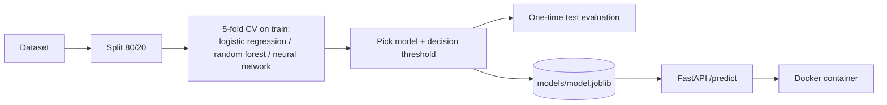

# NeuralFlow-AI


An end-to-end machine-learning project: **data → model comparison → saved model → REST API → tests → Docker.**
It classifies breast-tumour measurements as *malignant* or *benign* using scikit-learn's Breast Cancer Wisconsin (Diagnostic) dataset (569 samples, 30 numeric features).

> **Educational project. Not a medical device. Never use it for a real diagnosis.**



## Results (seed 0)

**Model comparison** (5-fold cross-validation on the 455 training samples, ROC-AUC):

| Model | CV ROC-AUC |
|---|---|
| Logistic regression | 0.9947 |
| Random forest (300 trees) | 0.9937 |
| Neural network (MLP 32→16) | 0.9954 |

All three are within 0.005 of each other, which is a **practical tie**. The rule "ties go to the simpler model" selects **logistic regression**. I did not claim the neural network is better, because the data does not show that.

**Test set** (114 unseen samples, used once): ROC-AUC **0.996**.

| Decision rule | Accuracy | Malignant caught | Malignant missed | False alarms |
|---|---|---|---|---|
| Default threshold 0.5 | 98.2% | 40 / 42 | 2 | 0 |
| Tuned threshold 0.1854 (deployed) | 95.6% | 40 / 42 | 2 | 3 |

Missing a malignant case is the costly mistake, so the deployed threshold is tuned to catch at least 98% of malignant cases on out-of-fold training predictions (`results/threshold_tradeoff.png`).

**Read this honestly.**
- On this one split the tuned threshold did **not** help: the same 2 cases were missed, plus 3 extra false alarms. Those 2 cases only got P(malignant) of 0.07 and 0.11, so the model was confidently wrong about them.
- One split of 114 samples is a weak judge. The 95% bootstrap interval for malignant recall is **[87.8%, 100%]**.
- So `evaluate_repeated.py` repeats the whole procedure on 10 random splits. Averaged per split (about 42 malignant cases each):

| Decision rule | Malignant missed | False alarms |
|---|---|---|
| Default 0.5 | 1.2 | 0.9 |
| Tuned threshold | 0.5 | 5.6 |

  The tuned threshold really does trade about 4.7 extra false alarms for 0.7 fewer missed cancers. Whether that is worth it is a decision for the people who use the system, not a coding question.

## API

Start it (see Quick start), then open **http://127.0.0.1:8000/docs** for the interactive page.

| Method | Path | Purpose |
|---|---|---|
| GET | `/health` | Is the service alive and the model loaded? |
| GET | `/model-info` | Selected model, threshold, feature names, training metrics |
| POST | `/predict` | Classify one sample (30 named measurements) |
| POST | `/predict-batch` | Classify 1 to 100 samples |

```bash
curl -X POST http://127.0.0.1:8000/predict \
  -H "Content-Type: application/json" \
  -d @examples/benign_sample.json
```
```json
{"label":"benign","probability_malignant":0.0672,"probability_benign":0.9328,
 "threshold":0.1854,"model":"logistic_regression","disclaimer":"Educational project. ..."}
```

Input is validated: a missing field, a negative or non-numeric value, or an unknown extra field returns **HTTP 422** with a clear message. The example rows in `examples/` come from the dataset itself, so the model may have seen them during training.

## Quick start

```bash
git clone https://github.com/Rebel7363/NeuralFlow-AI
cd NeuralFlow-AI
pip install -r requirements.txt

python train.py                      # trains, writes models/ and results/
python evaluate_repeated.py          # 10-split check of the threshold (optional)
uvicorn app.main:app --reload        # API on http://127.0.0.1:8000
pytest                               # 17 tests
```

### Docker
```bash
docker build -t neuralflow-ai .
docker run -p 8000:8000 neuralflow-ai
```
The image installs only the API dependencies, runs as a non-root user and has a health check.

## Project structure

| Path | Role |
|---|---|
| `train.py` | Split, compare models, choose model + threshold, evaluate once, save artefacts |
| `evaluate_repeated.py` | Repeats the procedure on 10 splits to judge the threshold fairly |
| `app/schemas.py` | Input/output shapes and validation rules |
| `app/main.py` | FastAPI app; loads the model once at startup and fails loudly if it is missing |
| `tests/` | Training logic, threshold logic and every API endpoint incl. bad input |
| `models/` | `model.joblib` and `meta.json` (threshold, feature order, metrics) |
| `results/` | `metrics.json`, `repeated_splits.json`, plots |
| `Dockerfile`, `.github/workflows/tests.yml` | Container and CI (tests, training run, Docker build + smoke test) |

## Design decisions

- **No data leakage:** the scaler lives inside the pipeline, so it is fitted on training folds only. The test set is used once.
- **Model choice by cross-validation, not by the test set.**
- **Ties go to the simpler model,** so a fancier model must earn its place.
- **Threshold chosen on out-of-fold training predictions,** never on the test set.
- **Fixed feature order and strict validation** in the API, so a wrong column order cannot silently give wrong answers.
- **Model loaded once at startup;** a missing or mismatched model stops the service immediately with a clear error.

## Limitations

- Small, clean, well-known dataset (569 rows). It says little about real clinical data, different scanners or other populations.
- One deployed model trained on 80% of the data; results vary between splits, see above.
- The model file is a pickle: only load model files you trained yourself. It is pinned to scikit-learn 1.8.0; retrain if you change the version.
- No authentication, rate limiting or monitoring. This is a learning project, not a production system.

## Data

Wolberg, Street, Mangasarian et al., *Breast Cancer Wisconsin (Diagnostic)*, UCI Machine Learning Repository, loaded through `sklearn.datasets.load_breast_cancer`.

## License
MIT
